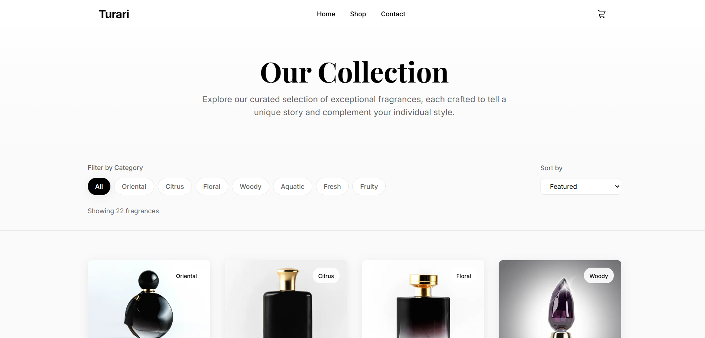
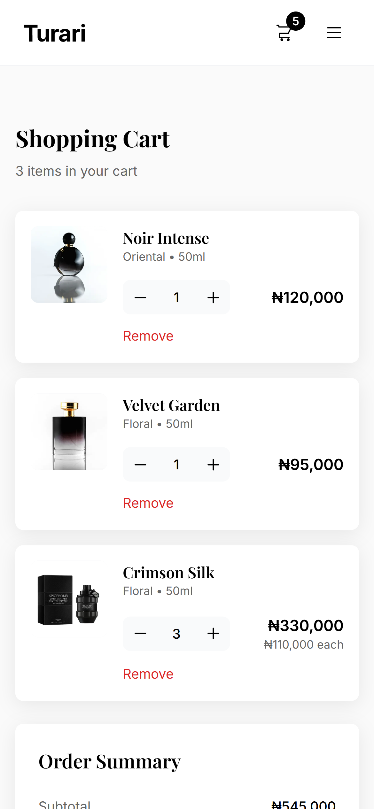
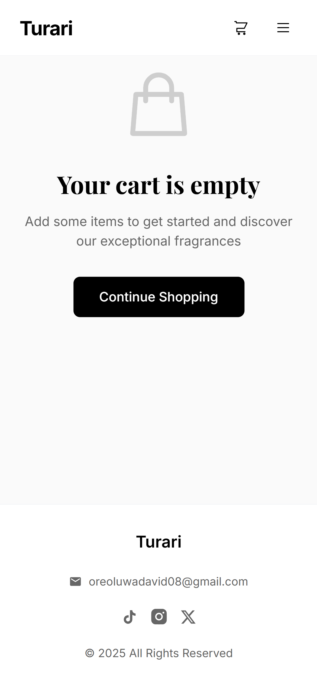
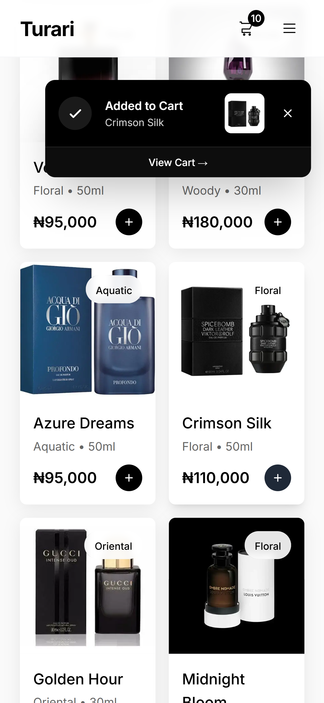

# Turari

A modern e-commerce platform for luxury perfumes built with Next.js, React, and TypeScript.

## Screenshots

### Hero Section


### Shop Page


### Shopping Cart
<p>
  
  
</p>

### Checkout & Notifications
<p>
  
  
</p>

## Features

- 🛍️ Curated perfume catalog
- 🛒 Shopping cart with persistent storage
- 💳 Stripe payment integration
- 📧 Automated order confirmations via Brevo
- ✨ Smooth page transitions
- 📱 Responsive design with TailwindCSS

## Tech Stack

- **Framework:** Next.js 15 (App Router)
- **UI:** React 19, TailwindCSS
- **Payments:** Stripe Elements
- **Email:** Brevo API
- **Language:** TypeScript

## Getting Started

1. Install dependencies:
```bash
npm install
```

2. Set up environment variables:
   - Copy `.env.local` and add your API keys
   - Get Stripe keys from [Stripe Dashboard](https://dashboard.stripe.com/test/apikeys)
   - Get Brevo API key from [Brevo Settings](https://app.brevo.com/settings/keys/api)

3. Run the development server:
```bash
npm run dev
```

4. Open [http://localhost:3000](http://localhost:3000)

## Payment Testing

Use Stripe test cards:
- **Success:** `4242 4242 4242 4242`
- Any future expiry date and any 3-digit CVC

## Project Structure

```
src/
├── app/              # Next.js app router pages
├── components/       # React components
├── lib/              # Utilities (Stripe, Brevo)
└── data.ts           # Product data
```

## Learn More

- [Next.js Documentation](https://nextjs.org/docs)
- [Stripe Docs](https://stripe.com/docs)
- [Brevo API](https://developers.brevo.com/)
